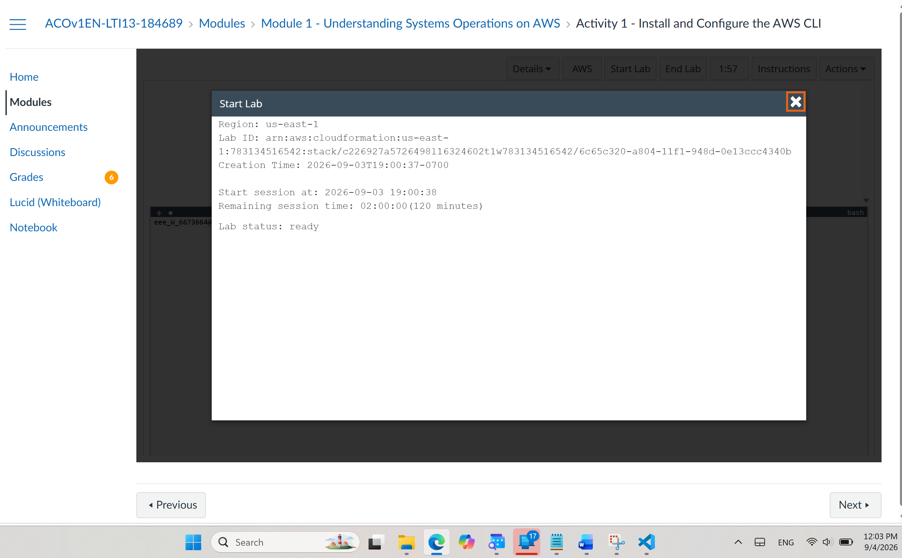

# Module 1, Activity 1 — Install and Configure the AWS CLI

> AWS Academy Cloud Operations learning journey documentation.
> Everything below is written in my own words based on completing this activity, not copied from the lab guide.

---

## 1. Lab Overview

| Item | Details |
|------|---------|
| **Activity title** | Install and Configure the AWS CLI |
| **Module** | Module 1 — Cloud Operations Foundations |
| **Estimated duration** | ~45 minutes |
| **Role-play scenario** | You act as Sophie, setting up AWS CLI access for the *Mom & Pop Café* AWS account |

### Introduction

The AWS Command Line Interface (AWS CLI) is a terminal-based tool that lets you interact with AWS services using commands instead of (or alongside) the point-and-click AWS Management Console. Cloud operators use the CLI for automation, scripting, and quick one-off tasks where clicking through the console would be slow.

In this activity, the AWS CLI is installed and used **from inside an Amazon EC2 instance** (a Red Hat Linux machine) rather than on a personal laptop. This matters because some AMIs (like Amazon Linux) come with the CLI pre-installed, but a cloud operator needs to know how to install and configure it from scratch on any machine — including preparing dependencies like Python and `unzip` first.

### Purpose of the lab

- Establish an SSH connection to a Red Hat EC2 instance
- Install the AWS CLI manually on that instance
- Configure the CLI with IAM credentials so it can talk to an AWS account
- Prove the setup works by querying IAM from the terminal

### Technologies and AWS services used

- **Amazon EC2** — the Red Hat Linux instance used as the "workstation"
- **AWS CLI v2** — the command line tool being installed
- **AWS IAM** — the service queried to verify the CLI works
- **SSH / PuTTY** — remote access to the instance
- **Python 3** — a prerequisite for the CLI installer

### Architecture at a glance

```
You --SSH--> [ Red Hat EC2 instance in a VPC ]
                    |
                    | AWS CLI (configured with awsstudent credentials)
                    v
              AWS IAM service
```

---

## 2. Learning Objectives

After completing this activity, I can:

1. **Install and configure the AWS CLI** on a Linux machine that doesn't have it.
2. **Connect the AWS CLI to an AWS account** using access key credentials.
3. **Access IAM using the AWS CLI** — running commands that return the same data I'd see in the console.

---

## 3. Prerequisites

- Access to the AWS Academy lab environment (Start Lab button, lab-provided credentials — not your own AWS account)
- Basic comfort with a Linux terminal (running commands with `sudo`)
- **Windows users:** PuTTY installed, and the lab-provided `labsuser.ppk` private key file downloaded
- **macOS/Linux users:** a terminal and the lab-provided `labsuser.pem` key file
- An IAM user (`awsstudent`) with an access key already created — you do **not** create the key yourself; it is provided in the lab's Credentials panel
- No prior AWS CLI experience required

---

## 4. Step-by-Step Instructions

### Accessing the AWS Management Console

1. Choose **Start Lab** at the top of the lab instructions and wait for **Lab status: ready** before opening the console via the **AWS** button.
   - *Why:* starting too early or working before "ready" leads to broken connections and missing resources.
2. If the console tab doesn't open, check for a browser pop-up blocker banner and allow pop-ups.
3. Keep the console tab open beside the instructions — you'll return to it in Task 3.





---

### Task 1: Connect to the Red Hat EC2 instance using SSH

**Windows users (PuTTY):**

1. Open the lab's **Details → Show** panel and download **`labsuser.ppk`** (read the next bullets first — the panel covers the instructions while open).
2. In PuTTY, under **Connection**, set **Seconds between keepalives** to `30`. This sends small packets so the session isn't dropped while you work.
3. Under **Session**, paste the instance's **Public DNS (or IPv4 address)** as the Host Name.
4. Expand **Connection → SSH → Auth → Credentials**, browse to the `labsuser.ppk` file, then open the connection.
5. Accept the host key prompt (first connection only), then log in as **`ec2-user`**.


> ⚠️ **Note:** The copy of the lab file I documented from did not include the numbered steps for **macOS/Linux users** or the step where the instance's Public DNS is noted. If you're on macOS/Linux, confirm those steps against your own lab instructions (typically: `chmod 400 labsuser.pem`, then `ssh -i labsuser.pem ec2-user@<public-dns>`).


**Why this task matters:** everything after this point happens *inside* the instance. A dropped or misconfigured SSH session is the #1 reason this lab stalls.

---

### Task 2: Install the AWS CLI on Red Hat Linux

All commands below run in the SSH terminal on the EC2 instance.

1. **Verify Python is available** — the CLI installer needs Python 2.6.5+ or Python 3.3+:

   ```bash
   python3 --version
   ```

   Expected output: `Python 3.8.x`.

2. **Install the `unzip` utility** — the CLI ships as a ZIP file:

   ```bash
   sudo yum install -y unzip
   ```

3. **Download, extract, and install the AWS CLI v2:**

   ```bash
   curl "https://awscli.amazonaws.com/awscli-exe-linux-x86_64.zip" -o "awscliv2.zip"
   unzip awscliv2.zip
   sudo ./aws/install
   ```

   *Why `sudo`:* the installer copies files to system paths (`/usr/local/bin/aws`, `/usr/local/aws-cli`) that a normal user can't write to.

4. **Verify the installation:**

   ```bash
   aws help
   ```

  You should see the AWS CLI help pages. Press `q` to exit.


---

### Task 3: Observe the IAM configuration in the Management Console

1. In the console, open the **IAM** service (search for `IAM` in the service search bar).
   - *Note:* IAM may show "you don't have permission" messages for some details — that's expected in the lab account; ignore them.
2. Go to **Users** and open the **`awsstudent`** user.
3. Expand **`lab_policy`** and view the **JSON** policy document. This policy defines which AWS services the `awsstudent` user is allowed to access.
4. Open the **Security credentials** tab. The **Access key ID** is visible, but the matching **secret access key** can never be retrieved again after creation — it was captured when the key was created and is provided in the lab's **Details → Show** Credentials panel.

**Why this task matters:** it connects the console view of IAM with the credentials you'll hand to the CLI in Task 4. Understanding that a secret key is shown **once, at creation time** is a real-world security lesson, not just lab trivia.


---

### Task 4: Configure the AWS CLI to connect to your AWS account

1. Back in the SSH terminal, run:

   ```bash
   aws configure
   ```

2. Answer the four prompts:

   | Prompt | Value |
   |--------|-------|
   | AWS Access Key ID | From the lab Credentials panel (**AccessKey**) |
   | AWS Secret Access Key | From the same Credentials panel (**SecretKey**) |
   | Default region name | `us-east-1` |
   | Default output format | `json` |

   *What this actually does:* `aws configure` writes these values into `~/.aws/credentials` and `~/.aws/config` on the instance. From now on, every `aws` command you run uses them automatically.


> 🔒 **Publishing tip:** never include real access keys in public screenshots — crop or blur them. In the lab environment the keys are temporary, but building the habit matters.

---

### Task 5: Observe IAM configuration using the AWS CLI

1. Test everything with:

   ```bash
   aws iam list-users
   ```

2. A successful run returns a **JSON response** listing the IAM users in the account — the same users you saw in the console in Task 3, just delivered as structured data instead of a web page.

**Why JSON matters:** because the output is machine-readable, you can pipe it into tools like `jq`, scripts, or automation pipelines — which is exactly why cloud operators prefer the CLI for repeated tasks.


## 6. My Learning Experience

### Challenge I faced

I hit two separate problems during this lab:

1. **The downloaded `labsuser.ppk` file was empty (0 bytes).** When I tried to connect with PuTTY, it couldn't use the key — an SSH connection needs a valid private key file, and an empty file is essentially nothing.
2. **My PuTTY session kept freezing mid-lab.** I hadn't set the keepalive option, and my session was dropped after being idle, which was frustrating because I had to reconnect and re-orient myself in the middle of the installation steps.

### How I investigated the problem

- **For the empty key file:** I checked the file size of `labsuser.ppk` in my Downloads folder and saw it was 0 KB. So the problem wasn't my PuTTY configuration — the key itself was broken. The lab also provided a `labsuser.pem` file, so I compared the two files and confirmed the `.pem` had actual content while the `.ppk` didn't. This told me the download had failed or been corrupted, and that I needed to generate a working `.ppk` from the `.pem` instead.
- **For the session freezing:** I noticed the freezes happened when I stopped typing for a few minutes — for example, while reading the next lab step or the AWS CLI help pages. That pattern (drop after idle time) pointed to a network/firewall idle timeout, not a problem with the instance itself.

### How I solved it

1. **Empty `.ppk` fix:** Instead of re-downloading (which might fail again), I used **PuTTYgen** to convert the working `.pem` file into a `.ppk`:
   - Opened **PuTTYgen** (it installs with PuTTY)
   - Went to **Conversions → Import key** and selected `labsuser.pem`
   - Clicked **Save private key** and saved it as `labsuser.ppk`
   - Loaded this new `.ppk` in PuTTY under **Connection → SSH → Auth → Credentials** — and the connection worked.
2. **Session freeze fix:** I configured the keepalive *before* connecting:
   - In PuTTY, went to **Connection**
   - Set **Seconds between keepalives** to `30`
   - Reconnected — this time the session stayed alive through the whole lab, even during the stretches where I was just reading instructions.

### What I learned from the experience

- **A 0-byte file is a red flag worth checking first.** Before assuming my configuration was wrong, checking the file size immediately told me the real problem was the download itself. Always verify your inputs (keys, files) before debugging your setup.
- **`.pem` and `.ppk` are the same key in different formats.** PuTTY only understands `.ppk`, so conversion with PuTTYgen is a normal, expected step — not a hacky workaround. Knowing how to convert between key formats is a skill I'll definitely reuse.
- **Idle timeouts are normal in cloud environments.** Setting keepalives (in PuTTY) or `ServerAliveInterval` (in OpenSSH) isn't optional for real work — dropped sessions mid-operation can be much more painful than in a lab.
- **Overall lesson:** when something fails, separate the problem into "is my input valid?", "is my configuration correct?", and "is it the network?" — checking in that order saved me a lot of guesswork here.

---

## 7. Final Results

The activity is complete when:

- ✅ You have an active SSH session to the Red Hat EC2 instance
- ✅ `aws help` displays the CLI help inside the terminal (CLI installed)
- ✅ `aws configure` completed with the lab credentials, region `us-east-1`, output `json`
- ✅ `aws iam list-users` returns a JSON list of IAM users matching what the IAM console showed

📸 **Final Result Screenshot:** Insert your final successful `aws iam list-users` JSON output here.

---

## 8. Key Takeaways

- The **AWS CLI is just another IAM client** — it uses the same access keys and policies as a console user, so IAM understanding comes first.
- A **secret access key is shown only once** at creation. Losing it means creating a new key pair — a fundamental AWS security concept.
- Installing the CLI isn't one step — it's a small chain (**Python check → unzip → download → extract → install → verify**), and each link can fail independently.
- `aws configure` writes credentials to `~/.aws/credentials` and settings to `~/.aws/config` — knowing *where* config lives makes debugging credential issues much faster.
- **CLI output (JSON) matches console data** — the console and CLI are two views of the same APIs, and the CLI view is what enables automation.
- Small operational habits matter: **keepalives** prevent dropped sessions, and **never publishing access keys** protects your accounts.

---

*Part of my AWS Academy Cloud Operations learning portfolio. Each README documents the lab, potential pitfalls, and my real troubleshooting experience.*
