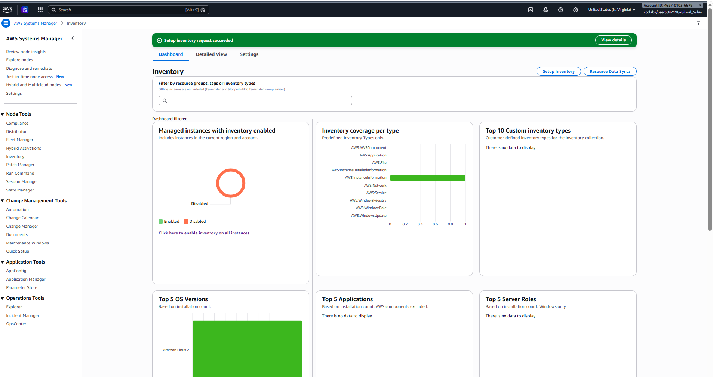
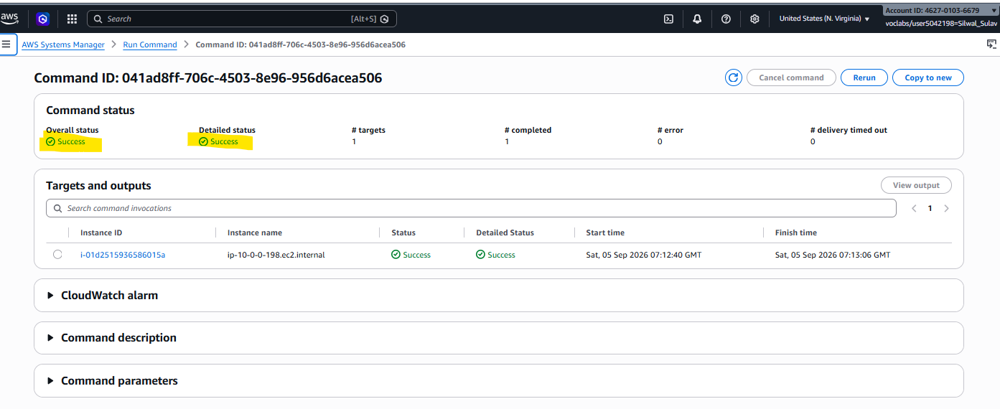
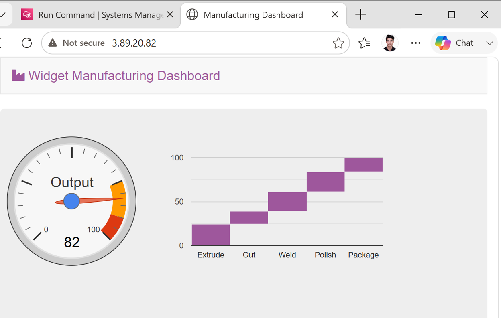
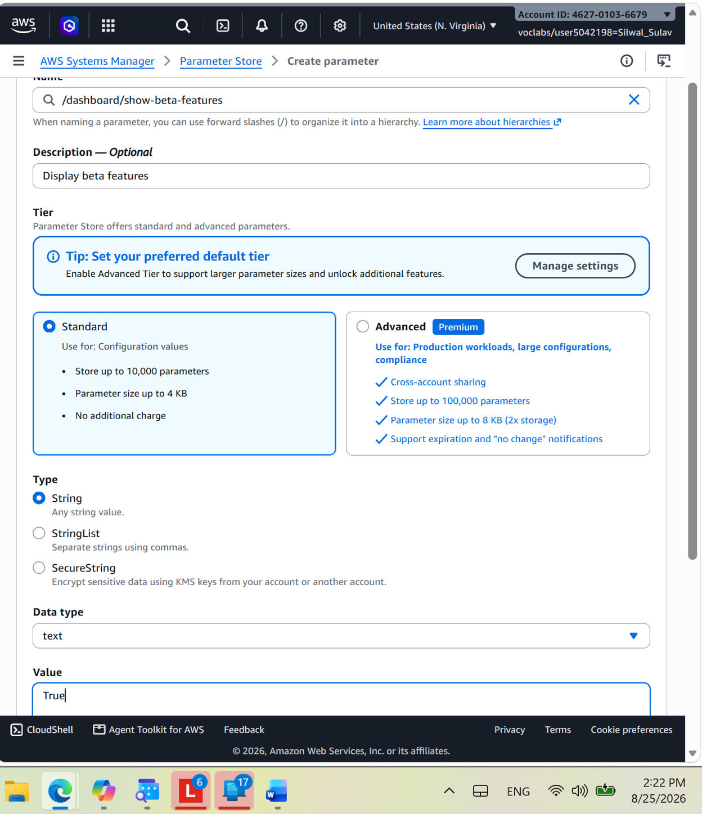
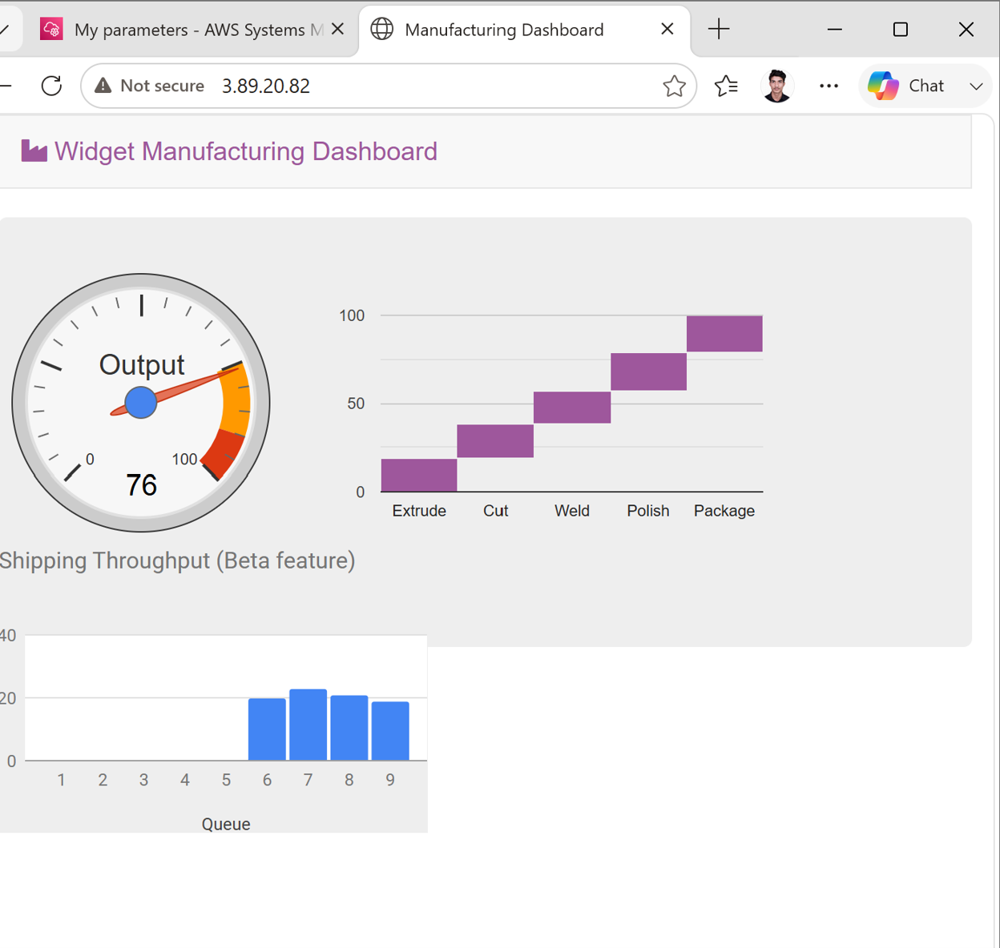
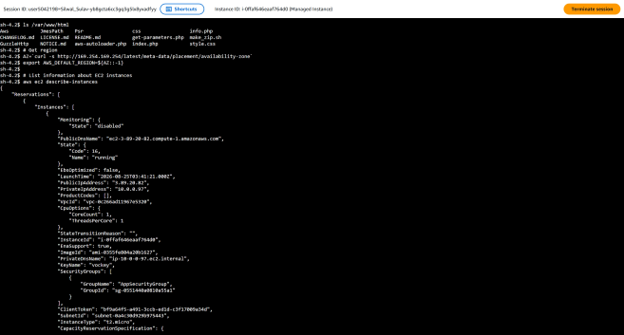

# Module 2, Lab 1 — Using AWS Systems Manager

> AWS Academy Cloud Operations learning journey documentation.
> Written in my own words based on completing this lab — not copied from the lab guide.

---

## 1. Lab Overview

| Item | Details |
|------|---------|
| **Lab title** | Using AWS Systems Manager |
| **Module** | Module 2 |
| **Estimated duration** | ~30 minutes |

### Introduction

AWS Systems Manager is a collection of tools for managing EC2 instances, on-premises servers, and other AWS resources at scale — all from one place, without having to log into each machine individually. Instead of SSH-ing into servers one by one, a cloud operator can collect inventory, run installation scripts, manage configuration values, and open shell sessions centrally.

This lab is essentially four mini-exercises, each showcasing one Systems Manager capability:

- **Inventory** — see what software and settings an instance has, without logging in
- **Run Command** — push a script to an instance and execute it remotely
- **Parameter Store** — manage application configuration values centrally
- **Session Manager** — get an interactive shell on an instance through the browser, with no SSH port open

### Purpose of the lab

- Verify instance configurations remotely using Systems Manager Inventory
- Install a custom web application (the *Widget Manufacturing Dashboard*) using Run Command
- Activate a hidden application feature using a Parameter Store value
- Access an instance's command line through Session Manager (no SSH needed)

### Technologies and AWS services used

- **AWS Systems Manager** — Fleet Manager, Run Command, Parameter Store, Session Manager
- **Amazon EC2** — one "Managed Instance" (pre-configured with the SSM agent)
- **Apache HTTP Server + PHP** — the stack installed by the Run Command script
- **IAM & CloudTrail (mentioned)** — Session Manager access is policy-controlled and logged

### Architecture at a glance

```
SysOps user
    |
    v
AWS Systems Manager (console)
    |-- Inventory association --> collects metadata from Managed Instance
    |-- Run Command (InstallDashboardApp) --> installs Apache/PHP/app on instance
    |-- Parameter Store (/dashboard/show-beta-features) --> app reads at runtime
    |-- Session Manager --> browser-based shell into instance (port 22 NOT open)
```

---

## 2. Learning Objectives

After completing this lab, I can:

1. **Set up a Systems Manager Inventory association** and review collected instance metadata.
2. **Run a pre-built command (Run Command)** against an instance and verify the result.
3. **Create a Parameter Store parameter** and see an application react to it in real time.
4. **Open a Session Manager session** to an instance and run shell commands — even though SSH port 22 is closed.

---

## 3. Prerequisites

- Access to the AWS Academy lab environment (Start Lab → lab status **ready** → open console)
- The lab provides a running **Managed Instance** with the Systems Manager (SSM) agent already installed and registered — this is why it appears in Fleet Manager; without the agent, none of these tasks work
- A web browser (used to view the installed dashboard and the Session Manager shell)
- No SSH client or key pairs needed for this lab — that's the whole point of Session Manager

---

## 4. Step-by-Step Instructions

### Accessing the AWS Management Console

1. Click **Start Lab**, wait for **Lab status: ready**, then click **AWS** to open the console.
2. **Do not change the Region** unless the lab instructions say so — Systems Manager associations and parameters are region-scoped, and the lab resources exist in one specific region.


*Figure 1: AWS Academy lab panel showing "Lab status: ready" before opening the console.*

---

### Task 1: Generate Inventory Lists for Managed Instances

Inventory collects metadata (OS details, installed software, configurations) from instances on a schedule, so you can audit your fleet without logging into each machine.

1. In the console, open **Systems Manager** from the Services menu.
2. In the left navigation pane, click **Fleet Manager**.
3. Under **Managed Instances**, select the instance named **Managed Instance**.
4. From the **Account management** menu, choose **Set up inventory** and configure:
   - **Name:** `Inventory-Association`
   - **Targets:** *Manually selecting instances* → check **Managed Instance**
5. Click **Setup Inventory** (bottom of the page).
   - *What just happened:* you created an *association* — a recurring task that tells the SSM agent on the instance to report its inventory data back to Systems Manager.
6. Click the **Instance ID** link in the Managed Instance row, then open the **Inventory** tab.
7. A list of applications installed on the instance appears. If it's empty, wait a minute and **refresh** — the first collection takes a short time.

Take a moment to explore the **Inventory type** dropdown — you can view applications, AWS components, network configs, and more.



*Figure 2: Systems Manager Inventory tab listing the applications installed on Managed Instance.*

**Why this matters:** this is how operators answer questions like "which instances are still running an outdated package?" across hundreds of servers — without a single SSH session.

---

### Task 2: Install a Custom Application using Run Command

Run Command executes a document (a pre-defined script) on target instances. Here, a document called *InstallDashboardApp* installs Apache, PHP, the AWS SDK for PHP, and the dashboard application itself.

1. In the left navigation pane, click **Run Command**.
2. Click the search icon 🔍, then filter:
   - **Owner:** *Owned by me*

   > *Tip:* the document doesn't show up in the default view — the owner filter is essential. Without it, the list only shows AWS-owned documents.

3. A document with **InstallDashboardApp** in its name appears — click the document **name** to view it (a new browser tab opens).
4. Click the **Content** tab and skim the script. Notice it:
   - Installs an Apache web server and PHP
   - Starts/enables the web server
   - Installs the AWS SDK for PHP
   - Installs the application files
5. Close that tab to return to **Run a command**.
6. Select the document (click the **circle/radio button**, not the name).
7. For **Targets:** choose **Choose instances manually** → check **Managed Instance**.
8. *(Optional)* Expand **AWS command line interface command** at the bottom — this shows you the exact CLI equivalent, useful if you ever want to script this instead of clicking.
9. Click **Run**, then watch the **Overall status** column: it shows **In Progress**, then **Success** (click refresh ⤾ occasionally).
10. Copy the **ServerIP** value from the lab's **Details → Show** panel.
11. Open a new browser tab, paste the IP, press Enter.

The **Widget Manufacturing Dashboard** loads — proof the app was installed remotely, without you ever logging into the instance.



*Figure 3: Run Command invocation for InstallDashboardApp showing Overall status = Success.*



*Figure 4: Widget Manufacturing Dashboard loaded in the browser, showing two charts before the Parameter Store change.*

---

### Task 3: Use Parameter Store to Manage Application Settings

Parameter Store holds configuration data and secrets centrally. Applications can read parameters at runtime — which means you can change app behavior without redeploying anything.

1. Keep the dashboard tab open, but return to the Management Console tab.
2. In the left navigation pane (under **Application Management**), click **Parameter Store**.
3. Click **Create parameter** and configure:
   - **Name:** `/dashboard/show-beta-features`
   - **Description:** `Display beta features`
   - **Value:** `True`
4. Click **Create parameter**.
   - *Note the hierarchical path format* — `/dashboard/<option>`. Organizing parameters in paths is the standard way to group related settings.
5. Return to the dashboard browser tab and **refresh** the page.

The dashboard now shows **three charts** instead of two. The application checked Parameter Store, found `/dashboard/show-beta-features = True`, and activated the "beta" chart that was installed all along but hidden.

**Optional test:** delete the parameter in the console, refresh the dashboard — the third chart disappears again. This proves the app is genuinely reading the parameter live.



*Figure 5: Parameter Store showing the created parameter `/dashboard/show-beta-features` with value True.*



*Figure 6: Dashboard after refreshing the page — the third (beta) chart appears because the application read the new parameter.*

**Why this matters:** this is the "feature flag" pattern in real life — companies ship features dark and toggle them on via configuration, often for specific user groups, without redeploying code.

---

### Task 4: Use Session Manager to Access Instances

Session Manager gives you an interactive browser-based shell on an instance — no SSH keys, no bastion hosts, and **no need to open port 22** in the security group.

1. In the console's left navigation pane, click **Session Manager**.
2. Click **Start Session**.
3. Select **Managed Instance**, then click **Start session**.
4. A session window opens in the browser — click inside it to activate the cursor.
5. Run:

   ```bash
   ls /var/www/html
   ```

   You see the application files that Run Command installed in Task 2 — now verified from *inside* the instance.

6. Run this command block to work out the region from instance metadata and query EC2:

   ```bash
   # Get region
   AZ=`curl -s http://169.254.169.254/latest/meta-data/placement/availability-zone`
   export AWS_DEFAULT_REGION=${AZ::-1}

   # List information about EC2 instances
   aws ec2 describe-instances
   ```

   The `curl` hits the EC2 instance metadata service (`169.254.169.254`) to learn which Availability Zone the instance lives in; `${AZ::-1}` trims the trailing letter (e.g. `us-east-1a` → `us-east-1`) to get the region. Then `aws ec2 describe-instances` works because the instance has an IAM role attached — no access keys needed.



*Figure 7: Session Manager browser-based shell showing the application files listed by `ls /var/www/html` and Output of `aws ec2 describe-instances` inside the Session Manager shell, using the region derived from instance metadata..*


**The security takeaway:** this instance doesn't have port 22 open in its security group at all — yet I got full shell access. Access is controlled by IAM policies instead of network rules, and every session is logged in CloudTrail. That's a fundamentally stronger security model than traditional SSH.

---

## 5. My Learning Experience

### Challenge I faced

After running the Run Command in Task 2, I opened the instance's **Public IP** in a new browser tab to view the Widget Manufacturing Dashboard — but instead of the app, the browser showed **"Hmmm… can't reach this page"** (Microsoft Edge). The dashboard simply wasn't loading at all.

### How I investigated the problem

- The error was a *connection-level* failure ("can't reach this page"), not an application error page — so the request wasn't even reaching a working web server. That pointed to the application stack not being fully up yet, or the installation not having completed properly.
- I reviewed the steps I had done so far and decided to re-trace them rather than guess: I re-checked the inventory association setup from Task 1 and the Run Command execution from Task 2, looking for anything that hadn't fully completed.
- *(Adjust this line to your case:)* My first Run Command had shown [Success / In Progress] when I first opened the IP — so the most likely explanation was that the web server/app stack wasn't fully ready when I first tried, or the first execution hadn't installed everything correctly.

### How I solved it

1. Re-ran the **Set up inventory** steps for the Managed Instance (re-checking the association was properly created).
2. Went back to **Run Command**, applied the **Owner → Owned by me** filter, selected the **InstallDashboardApp** document again, targeted **Managed Instance**, and clicked **Run** to reinstall the application stack.
3. Waited for the **Overall status** to reach **Success**, then re-opened the **ServerIP** in the browser.
4. This time the **Widget Manufacturing Dashboard loaded correctly**.

### What I learned from the experience

- **A connection error ("can't reach this page") means the server side isn't ready — don't assume the network is broken.** In this lab the likely cause was on the instance: the app stack simply wasn't fully installed/running yet.
- **Re-tracing your setup steps is a legitimate troubleshooting technique.** Instead of randomly changing things, I re-checked the two setup stages (inventory association, Run Command install) and re-executed the install — that fixed it.
- **The "Owned by me" filter matters in practice, not just in theory** — I needed it again when re-running the document, and forgetting it makes the document seem to "disappear."
- **Patience with Run Command:** these install scripts take minutes; opening the dashboard too early is an easy mistake. Waiting for **Success**, then browsing, is the reliable sequence.

## 6. Final Results

The lab is complete when:

- ✅ Fleet Manager shows **Managed Instance** with an active inventory association
- ✅ The **Inventory** tab lists installed applications on the instance
- ✅ Run Command (`InstallDashboardApp`) shows **Overall status: Success**
- ✅ The **Widget Manufacturing Dashboard** loads at the ServerIP address (two charts)
- ✅ Creating `/dashboard/show-beta-features = True` makes a **third chart** appear after refresh
- ✅ Session Manager opens a working shell; `ls /var/www/html` shows the app files, and `aws ec2 describe-instances` returns instance data


---
## 7. Key Takeaways

- **Systems Manager removes the need for SSH in day-to-day operations.** Inventory, patching-style commands, config changes, and shell access all happen centrally — and Session Manager works even with port 22 closed.
- **Everything depends on the SSM agent + IAM role.** The single most common reason Systems Manager tasks fail is an instance that isn't registered as a managed instance. Check Fleet Manager first, always.
- **Run Command = repeatable, auditable execution.** Pre-built documents make installs consistent across a fleet, and every invocation has a status and output log you can inspect.
- **Parameter Store enables the feature-flag pattern.** Applications can check configuration at runtime, so behavior changes without redeployment — and hierarchical paths (`/app/feature`) keep settings organized.
- **Instance metadata + IAM roles eliminate hardcoded credentials.** The `curl 169.254.169.254` trick to discover the region, combined with the instance role, let me run `aws ec2 describe-instances` with zero access keys configured.
- **Small UI details matter:** the **Owned by me** filter in Run Command and clicking the *radio button* instead of the name are the kind of tiny gotchas that cost beginners ten minutes each.

---

*Part of my AWS Academy Cloud Operations learning portfolio. Each README documents the lab, potential pitfalls, and my real troubleshooting experience.*
